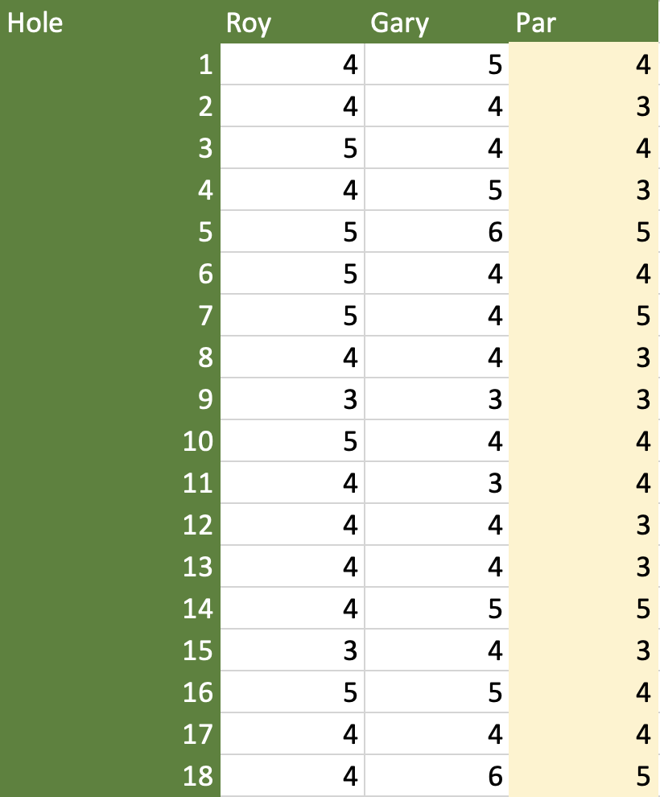
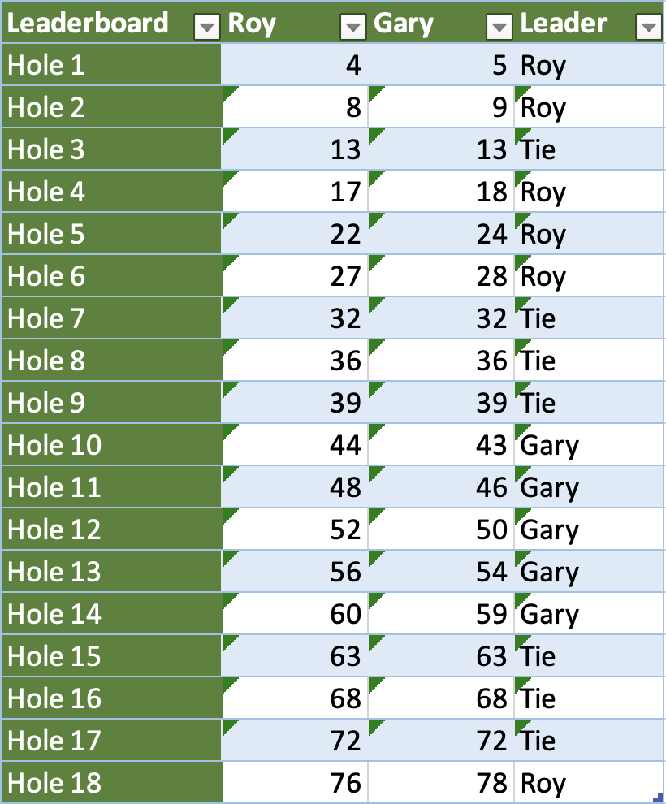
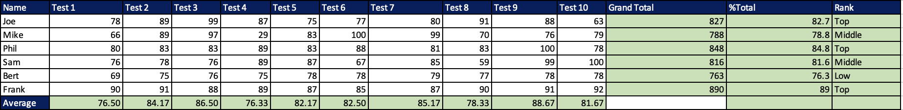

# excel-golf-and-class-analysis
Excel projects demonstrating automated golf scoring, student grade calculations and data analysis.

# Excel Projects: Golf Tournament and Class Analysis

A collection of Excel projects demonstrating spreadsheet
modelling, automated calculations, conditional logic and
data analysis.

## 1. Golf Tournament

An automated 18-hole golf scorecard comparing two players.

The workbook includes:
- Hole-by-hole scoring and comparisons against par.
- Automatic identification of each hole's winner.
- Cumulative scores and a live leaderboard.
- Final tournament results and summary statistics.

### Golf Scorecard

### Live Leaderboard

## 2. Class Performance Analysis

An Excel exercise analysing the results of six students
across ten assessments.

The workbook includes:
- Individual test scores and overall totals.
- Percentage calculations and performance classifications.
- Average scores for each assessment.
- Comparison of student and class performance.

### Class Results

## 3. Excel Skills Demonstrated

- Spreadsheet modelling and formula-based calculations.
- Conditional logic and automated classifications.
- Statistical summaries and comparative analysis.
- Data presentation and automated scorekeeping.

## 4. Download the Workbook

[View the Excel workbook](workbook/Excel%20Training.xlsx)
